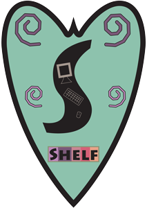

 SHELF
===================================================

A REST API for AWS S3 meant to be an interface to immutable artifact storage.

It is suggested that you use [gunicorn](http://gunicorn.org/) for running in production but we provide a simple script to run it
for development purposes in `bin/main.py`.

Documentation
-------------

[You can view a list of our capabilities and how to use the API provided here.](docs/README.md)

[Here you can view a list of our limitations.](docs/limitations.md)
